# AEGIS Treasury Intelligence — Architecture

## System Overview

AEGIS is a single-page application built on Next.js 16 App Router, designed as a modular, route-group-based treasury intelligence platform. The architecture emphasizes separation of concerns, type safety, and performance through React Server Components, incremental static regeneration, and client-component isolation.

The platform operates in two modes:
- **Demo Mode** (default) — all data sourced from a mock data layer (`@/lib/mock-data`)
- **Production Mode** — data sourced from REST/GraphQL APIs via service adapters

---

## Architecture Diagram

```mermaid
graph TD
    subgraph "Client Layer"
        A[Browser] --> B[Next.js Edge/CDN]
    end

    subgraph "Next.js 16 App Router"
        B --> C[Middleware]
        C --> D[Root Layout]
        D --> E[App Shell]
        E --> F[Sidebar Navigation]
        E --> G[Header/Search]
        
        D --> H[Route Groups]
        H --> I["/(dashboard)"]
        H --> J["/(treasury)"]
        H --> K["/(transactions)"]
        H --> L["/(revenue)"]
        H --> M["/(risk)"]
        H --> N["/(forecasting)"]
        H --> O["/(insights)"]
        H --> P["/(audit)"]
    end

    subgraph "Component Architecture"
        I --> Q[Server Components]
        I --> R[Client Components]
        R --> S[Framer Motion]
        R --> T[Recharts]
        R --> U[Radix UI]
        Q --> V[Mock Data / API]
    end

    subgraph "Data Layer"
        V --> W[Mock Data Store]
        V --> X[API Service Layer]
        W --> Y[Zustand Store]
        X --> Y
    end

    subgraph "Infrastructure"
        B --> Z[Vercel Edge Network]
        Z --> AA[ISR Cache]
        Z --> AB[Static Assets CDN]
    end

    style A fill:#0a0a0f,stroke:#10b981
    style B fill:#0a0a0f,stroke:#10b981
    style D fill:#0a0a0f,stroke:#10b981
    style V fill:#0a0a0f,stroke:#10b981
```



---

## Route Design

| Route | Module | Type | Description |
|-------|--------|------|-------------|
| `/` | Dashboard | Server + Client | KPI overview, charts, activity feed |
| `/treasury` | Treasury | Client | Multi-asset balance management |
| `/transactions` | Transactions | Client | Payment and transfer monitoring |
| `/revenue` | Revenue | Client | MRR, ARR, LTV analytics |
| `/risk` | Risk Engine | Client | Anomaly detection, scoring gauge |
| `/forecasting` | Forecasting | Client | ML-powered cash flow predictions |
| `/insights` | Insights | Client | AI-driven financial intelligence |
| `/audit` | Audit | Client | Immutable compliance trail |
| `/profile` | Profile | Client | User profile management |
| `/settings` | Settings | Client | Platform configuration |

All routes share a common layout with sidebar navigation and header via the root layout group.

---

## Component Hierarchy

```
RootLayout
├── Providers (Theme, Zustand)
├── AppShell
│   ├── Sidebar
│   │   ├── Logo
│   │   ├── NavItems
│   │   └── UserMenu
│   ├── Header
│   │   ├── SearchBar
│   │   ├── Notifications
│   │   └── Avatar
│   └── MainContent (page outlet)
│
├── Page Components (per route)
│   ├── DashboardPage
│   │   ├── KpiGrid
│   │   │   ├── KpiCard (x6)
│   │   ├── RevenueChart
│   │   │   ├── ChartTooltip
│   │   │   └── ChartLegend
│   │   ├── RecentTransactions
│   │   │   └── TransactionRow (x4)
│   │   └── ActivityFeed
│   │       └── ActivityItem (xN)
│   └── ... (other page layouts)
│
└── Shared Components
    ├── ui/ (shadcn primitives)
    ├── charts/ (Recharts wrappers)
    ├── skeletons.tsx (loading states)
    └── forms/ (form components)
```

---

## Data Flow

```
User Action → Client Component → Zustand Action → Data Service
                                                       │
                                          ┌────────────┼────────────┐
                                          ▼            ▼            ▼
                                     Mock Data     REST API     WebSocket
                                          │            │            │
                                          └────────────┼────────────┘
                                                       │
                                                       ▼
                                               State Update
                                                       │
                                                       ▼
                                              React Re-render
                                                       │
                                                       ▼
                                              Framer Motion
                                              Chart Update
```

### Current Implementation
- All data flows through `@/lib/mock-data.ts` which exposes async functions that simulate API latency
- Zustand store (`@/store/`) holds dashboard-level state and provides actions to fetch/update data
- Server Components (`page.tsx`) do initial data fetching; Client Components handle interactivity
- Transitioning to real APIs requires only swapping the data service layer — component interfaces remain unchanged

---

## State Management

**Tool**: Zustand with devtools middleware

**Store Structure**:
```
store/
├── dashboard-store.ts    # KPI data, chart data, loading states
├── treasury-store.ts     # Balance data, asset allocations
├── transaction-store.ts  # Transaction list, filters, pagination
└── settings-store.ts     # User preferences, theme config
```

**Pattern**:
- Each store is a standalone Zustand store with slices
- Actions are async thunks that call data services
- Selectors are used in components for granular re-renders
- Devtools integration for debugging

---

## Performance Strategy

| Technique | Application |
|-----------|-------------|
| **React Server Components** | Static page layouts, initial data fetching |
| **Client Component Isolation** | Interactive elements only, minimized bundle |
| **Dynamic Import** | Heavy charts and visualization components |
| **ISR** | Dashboard pages with revalidation |
| **Image Optimization** | Next.js Image component with AVIF/WebP |
| **Code Splitting** | Automatic per-route by App Router |
| **Skeleton Loading** | 60fps loading states via CSS animations |
| **Memoization** | React.memo on chart components, useMemo on data transforms |

---

## Security Model

| Layer | Protection |
|-------|-----------|
| **HTTP Headers** | X-Frame-Options, X-Content-Type-Options, X-XSS-Protection, Referrer-Policy, CSP-ready |
| **API** | Authentication-required endpoints (placeholder) |
| **Client** | Input validation with Zod schemas |
| **Build** | Console stripping in production |
| **Deployment** | HTTPS enforced by Vercel, environment variable isolation |

---

## Deployment Architecture

```
┌─────────────┐     ┌──────────────┐     ┌──────────────┐
│   GitHub    │────▶│   Vercel     │────▶│   Edge CDN   │
│   Repository│     │   Import     │     │   (Global)   │
└─────────────┘     └──────┬───────┘     └──────┬───────┘
                           │                     │
                           ▼                     ▼
                    ┌──────────────┐     ┌──────────────┐
                    │  Build Step  │     │   ISR Cache  │
                    │  npm run build│    │  (Edge)      │
                    └──────┬───────┘     └──────────────┘
                           │
                           ▼
                    ┌──────────────┐
                    │  Production  │
                    │  Deployment  │
                    │  (Vercel)    │
                    └──────────────┘
```

### Infrastructure
- **Hosting**: Vercel (Global Edge Network)
- **Region**: iad1 (US East — primary)
- **CDN**: Vercel Edge Cache with immutable asset caching
- **DNS**: Vercel-managed with custom domain
- **CI/CD**: Automatic deployments from main branch
- **Preview**: Per-branch preview deployments

### Docker Alternative
```dockerfile
FROM node:20-alpine AS base
FROM base AS deps
COPY package.json ./
RUN npm install --legacy-peer-deps
FROM base AS runner
COPY --from=deps /app/node_modules ./node_modules
COPY . .
EXPOSE 4001
CMD ["npm", "run", "start"]
```
